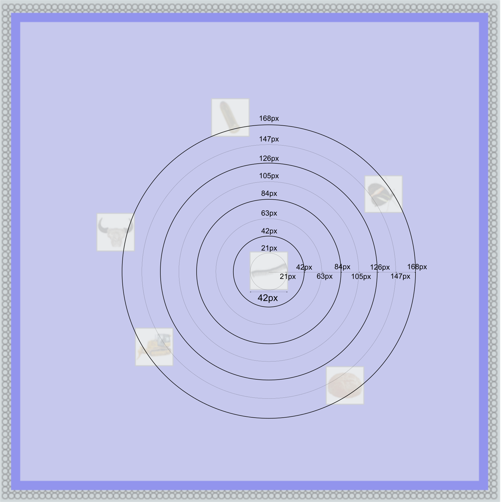

```{r setup, include=FALSE}
knitr::opts_chunk$set(echo = FALSE)
```

```{r load-all-libraries, message=FALSE, warning=FALSE, results=FALSE}

# Clean the environment
rm(list=ls())

# Load libraries
library(tidyverse)
library(rstatix)
library(DT)
library(kableExtra)
# library(rjson)
library(readr)
library(writexl)
library(jsonlite)
library(stringr)
library(gridExtra)
library(knitr)

```


```{r flags}

writeInExcel <- F

```


```{r read-json-file}
filenames <- c('jatos_results_20210620174618',
               'jatos_results_20210620174558',
               'jatos_results_20210620174455',
               'jatos_results_20210623104448',
               'jatos_results_20210630113300',
               'jatos_results_20210630101845',
               'jatos_results_20210630101826')

# filenames <- 'jatos_results_20210630101845'

session_results_all_ptp <- NULL

for (iName in filenames){
        # print(iName)
        
        filepath <- paste('../data/pilots/gui_downloads/',iName,'.txt', sep='')
        
        my_data <- read_file(filepath)
        
        # Find the data submission module
        start_loc <- str_locate(my_data, 'data_submission_start---')[2]
        end_loc   <- str_locate(my_data, '---data_submission_end]')[1]
        
        json_content <- substr(my_data,start_loc+1,end_loc-1)
        
        json_decoded <- fromJSON(json_content)
        
        session_results <- as_tibble(json_decoded$outputData$session_results)
        
        # All the mutations
        session_results <- session_results %>%
                mutate(session_global = as.factor(
                        case_when(stage == 'new_pa_learning' & 
                                          session$new_pa_learning == 1 ~ 4,
                                  stage == 'new_pa_learning' & 
                                          session$new_pa_learning == 2 ~ 5,
                                  TRUE ~ as.double(session$schema_learning))),
                       session_condition = as.factor(
                               case_when(stage == 'new_pa_learning' & 
                                                 session$new_pa_learning == 1 ~ 1,
                                         stage == 'new_pa_learning' & 
                                                 session$new_pa_learning == 2 ~ 2,
                                         TRUE ~ as.double(session$schema_learning))),
                       stage = as.factor(stage),
                       condition = as.factor(condition),
                       correct = as.numeric(correct),
                       stimulus = as.factor(stimulus),
                       rc_dist_cb = corr_row-row + corr_col-col,
                       rc_dist_euclid = sqrt(
                               (corr_row-row)^2 + (corr_col-col)^2
                       ),
                       mouse_dist_cb = abs(mouse_clientX - pa_center_x) +
                               abs(mouse_clientY - pa_center_y),
                       mouse_dist_euclid = sqrt((mouse_clientX - pa_center_x)^2 +
                                                        (mouse_clientY - pa_center_y)^2),
                       roughly_correct = case_when(
                               abs(rc_dist_euclid) < 2 ~ 1,
                               TRUE ~ 0
                       ),
                       correct_rad_21 = case_when(
                               abs(mouse_dist_euclid) <= 21 ~ 1,
                               TRUE ~ 0
                       ),                       
                       correct_rad_42 = case_when(
                               abs(mouse_dist_euclid) <= 42 ~ 1,
                               TRUE ~ 0
                       ),                                              
                       correct_rad_63 = case_when(
                               abs(mouse_dist_euclid) <= 63 ~ 1,
                               TRUE ~ 0
                       ),
                       correct_rad_84 = case_when(
                               abs(mouse_dist_euclid) <= 84 ~ 1,
                               TRUE ~ 0
                       ),                       
                       correct_rad_105 = case_when(
                               abs(mouse_dist_euclid) <= 105 ~ 1,
                               TRUE ~ 0
                       ),   
                       correct_rad_126 = case_when(
                               abs(mouse_dist_euclid) <= 126 ~ 1,
                               TRUE ~ 0
                       ),
                       correct_rad_147 = case_when(
                               abs(mouse_dist_euclid) <= 147 ~ 1,
                               TRUE ~ 0
                       ),
                       correct_rad_168 = case_when(
                               abs(mouse_dist_euclid) <= 168 ~ 1,
                               TRUE ~ 0
                       )                 
                )
        
        session_results <- session_results %>%
                mutate(ptp = json_decoded$prolific_ID, .before = rt,
                       ptp = as.factor(ptp))
        
        # Add a row counter for each occurrence of a stimulus, 
        # within that condition and within that session
        session_results <- session_results %>%
                group_by(condition,session_global,stimulus) %>%
                mutate(stimulus_row_number = row_number()) %>%
                ungroup()
        
        session_results_all_ptp <- bind_rows(session_results_all_ptp,session_results)
        
}
```


```{r gather-data, message=FALSE}

# Turn to long form with accuracy types as one column
session_results_all_ptp_gathered <- 
        session_results_all_ptp %>%
        pivot_longer(cols = starts_with('correct_rad'),
                     names_to = 'accuracy_type',
                     values_to = 'accuracy',
                     names_prefix = "correct_")

session_avg_gathered <- 
        session_results_all_ptp_gathered %>%
        filter(stage != 'practice') %>%
        mutate(accuracy = coalesce(accuracy,0)) %>%
        group_by(ptp,condition,session_global,accuracy_type) %>%
        summarize(avg_correct = mean(accuracy, na.rm=T)) %>%
        ungroup()

```

# Description:

What changed: 

- Added color to the board background.
- Added patterned outline.
- The board is smaller now 500x500 px.
- The board is randomly positioned within a 700x700 arena.
- The prompt picture appears separately on a screen, instead of appearing below the board. Thus, participants can't use that image and text as landmarks.

## Exact vs rough accuracy

Rough accuracy is 1 city-block distance away from the correct cell.

People struccle in schema-IC condition. Images change location after every session. Are we ok with performance being so low for each session? 

No clear difference at the new-PA learning stage between schema-C and schema-IC

``` {r exact-rough-accuracy, message=FALSE, fig.height=10, fig.width = 8}
# Exact performance across sessions, C vs IC
stimulus_avg <-
        session_results_all_ptp %>%
        filter(stage != 'practice') %>%
        mutate(correct = coalesce(correct,0)) %>%
        group_by(ptp,condition,session_global,stimulus) %>%
        summarize(avg_corr = mean(correct, na.rm=T)) %>% 
        ungroup()


session_avg <- stimulus_avg %>%
        group_by(ptp,condition,session_global) %>%
        summarize(avg_corr = mean(avg_corr, na.rm=T)) %>%
        ungroup()

ggplot(data = stimulus_avg, aes(x=session_global, y=avg_corr)) +
        geom_point(aes(color=stimulus, group=stimulus)) +
        geom_line(aes(color=stimulus, group=stimulus)) +
        theme(legend.position = 'none') +
        facet_grid(ptp~condition, labeller=label_both) + 
        geom_line(data = session_avg, aes(group=condition),size = 1) +
        geom_point(data = session_avg, aes(group=condition)) + 
        ylim(0,1) + 
        ggtitle('Exact accuracy')

# Roughly correct now:
stimulus_avg <-
        session_results_all_ptp %>%
        filter(stage != 'practice') %>%
        mutate(correct_rad_63 = coalesce(correct_rad_63,0)) %>%
        group_by(ptp,condition,session_global,stimulus) %>%
        summarize(avg_corr = mean(correct_rad_63, na.rm=T)) %>% 
        ungroup()


session_avg <- stimulus_avg %>%
        group_by(ptp,condition,session_global) %>%
        summarize(avg_corr = mean(avg_corr, na.rm=T)) %>%
        ungroup()


ggplot(data = stimulus_avg, aes(x=session_global, y=avg_corr)) +
        geom_point(aes(color=stimulus, group=stimulus)) +
        geom_line(aes(color=stimulus, group=stimulus)) +
        theme(legend.position = 'none') +
        facet_grid(ptp~condition, labeller=label_both) + 
        geom_line(data = session_avg, aes(group=condition),size = 1) +
        geom_point(data = session_avg, aes(group=condition)) + 
        ylim(0,1) + 
        ggtitle('correct_rad_63')

```

## Within session learning plots


```{r within-session-learning, fig.height=8, fig.width=8}

condition_to_plot <- 'schema_ic'

# - get the average performance within session across presentation number
trial_avg <- 
        session_results_all_ptp %>%
        filter(stage != 'practice' & condition == condition_to_plot) %>%
        mutate(correct = coalesce(correct,0)) %>%
        group_by(ptp,condition,session_global,stimulus_row_number) %>%
        summarize(correct = mean(correct, na.rm = T)) %>%
        ungroup()


session_results_all_ptp %>%
        filter(stage != 'practice' & condition == condition_to_plot) %>% 
        mutate(correct = coalesce(correct,0)) %>%
        group_by(ptp,condition,session_global,stimulus) %>%
        ggplot(aes(x=stimulus_row_number,y=correct)) +
        geom_point(aes(color=stimulus, group=stimulus)) + 
        geom_line(aes(color=stimulus,group=stimulus)) + 

        
        geom_point(data = trial_avg, aes(group=condition)) + 
        geom_line(data = trial_avg, aes(group=condition),size=1) + 
        
        facet_grid(ptp~session_global, labeller=label_both) + 
        ggtitle(paste('Within session learning. ', condition_to_plot,'. Accuracy type: exact',sep='')) + 
        theme(legend.position = 'none')

# - get the average performance within session across presentation number
trial_avg <- 
        session_results_all_ptp %>%
        filter(stage != 'practice' & condition == condition_to_plot) %>%
        mutate(correct = coalesce(correct,0)) %>%
        group_by(ptp,condition,session_global,stimulus_row_number) %>%
        summarize(correct = mean(correct, na.rm = T)) %>%
        ungroup()


session_results_all_ptp %>%
        filter(stage != 'practice' & condition == condition_to_plot) %>% 
        mutate(correct = coalesce(correct,0)) %>%
        group_by(ptp,condition,session_global,stimulus) %>%
        ggplot(aes(x=stimulus_row_number,y=correct)) +
        geom_point(aes(color=stimulus, group=stimulus)) + 
        geom_line(aes(color=stimulus,group=stimulus)) + 

        
        geom_point(data = trial_avg, aes(group=condition)) + 
        geom_line(data = trial_avg, aes(group=condition),size=1) + 
        
        facet_grid(ptp~session_global, labeller=label_both) + 
        ggtitle(paste('Within session learning. ', condition_to_plot,'. Accuracy type: exact',sep='')) + 
        theme(legend.position = 'none')


```


## Multiple radii

I also coded accuracy as a function of radius around the target location.
The targets are about 42x42px on the screen. So I've taken radii in steps of 21 pixels. 

See this screenshot to get a sense of the size of the various radii.

```{r snapshot}



```

### Plot descriptions:

Below are 4 plots: 2 for schema-C and 2 for schema-IC.

In all plots, rows are participants.

In the 1st and 3rd plots, columns are sessions, with 4th session being new PA learning. Here, X axes are various accuracy types.

In the 2nd and 4th plots, columns are accuracies measured with different radii. Here, X axes are sessions


From the data, seems like radius of 63 might be a good one.


```{r radii, warning=FALSE, message=FALSE}

##############################################################################
# Try multiple radii

conditions_to_plot <- c('schema_c','schema_ic')

for (iCond in conditions_to_plot){
        
        # - Radii as X axis
        plot1 <- 
        session_results_all_ptp_gathered %>%
                filter(stage != 'practice' & 
                               condition == iCond) %>%
                group_by(ptp,session_global,accuracy_type,stimulus) %>%
                summarize(avg_correct = mean(accuracy)) %>%
                reorder_levels(accuracy_type, order = c(
                        'rad_21',
                        'rad_42',
                        'rad_63',
                        'rad_84',
                        'rad_105',
                        'rad_126',
                        'rad_147',
                        'rad_168'
                )) %>%
                ungroup() %>% 
                ggplot(aes(x=accuracy_type,y=avg_correct)) + 
                geom_point(aes(group=stimulus,color=stimulus)) + 
                geom_line(aes(group=stimulus,color=stimulus)) +
                theme(legend.position = 'none',
                      axis.text.x = element_text(angle=-90)) + 
                geom_point(data = filter(session_avg_gathered,condition == iCond)) +         
                geom_line(data = filter(session_avg_gathered,condition == iCond),
                          aes(group=condition)) +                 
                facet_grid(ptp~session_global, labeller=label_both) + 
                ylim(0,1) + 
                ggtitle(iCond)

        print(plot1)
        
        # Session as the within line
        plot2 <-
        session_results_all_ptp_gathered %>%
                filter(stage != 'practice' & 
                               condition == iCond) %>%
                group_by(ptp,session_global,accuracy_type,stimulus) %>%
                summarize(avg_correct = mean(accuracy)) %>%
                reorder_levels(accuracy_type, order = c(
                        'rad_21',
                        'rad_42',
                        'rad_63',
                        'rad_84',
                        'rad_105',
                        'rad_126',
                        'rad_147',
                        'rad_168'
                )) %>%
                ungroup() %>% 
                ggplot(aes(x=session_global,y=avg_correct)) + 
                geom_point(aes(group=stimulus,color=stimulus)) + 
                geom_line(aes(group=stimulus,color=stimulus)) +
                geom_point(data = filter(session_avg_gathered,condition == iCond)) +
                geom_line(data = filter(session_avg_gathered,condition == iCond),
                          aes(group=condition)) +          
                theme(legend.position = 'none') + 
                facet_grid(ptp~accuracy_type) + 
                ylim(0,1) + 
                ggtitle(iCond)
        
        print(plot2)

}
```


```{r}

if (writeInExcel){
        write_xlsx(session_results,paste('../../',filename,'.xlsx',sep=''))        
}


```

